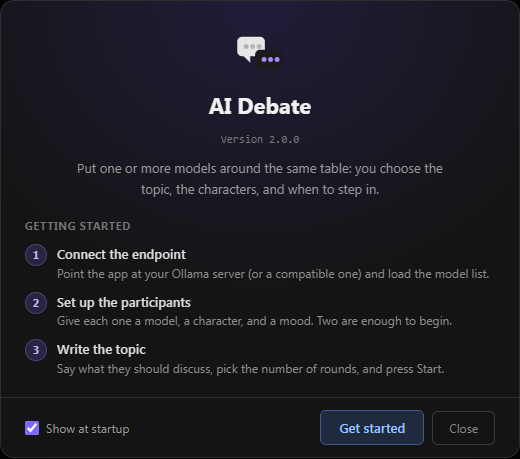
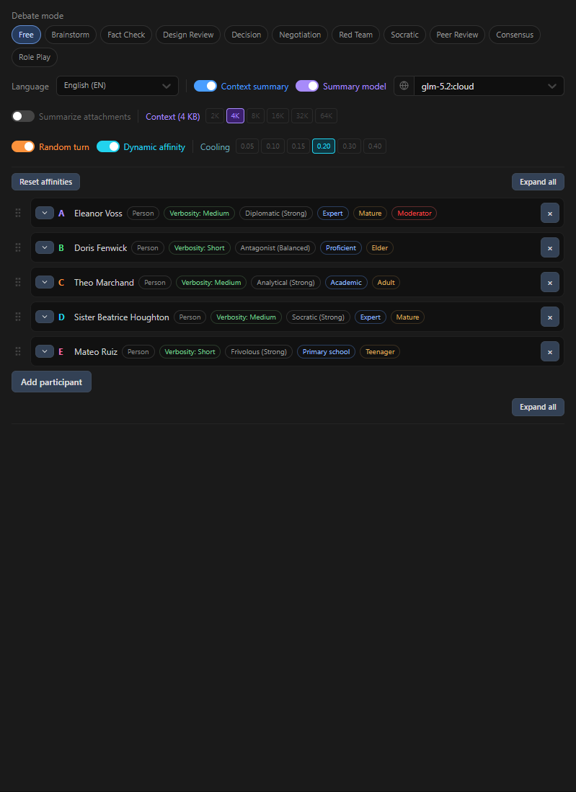
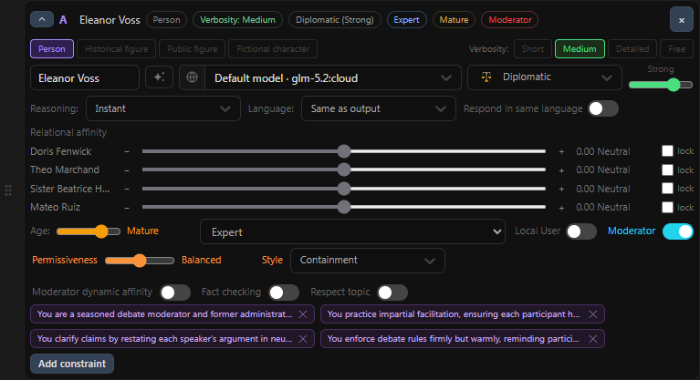
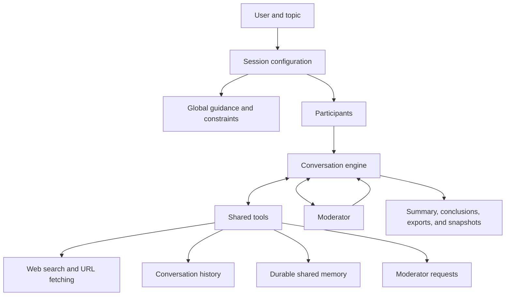
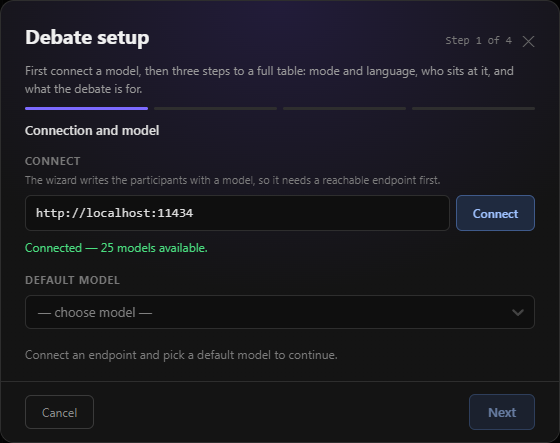
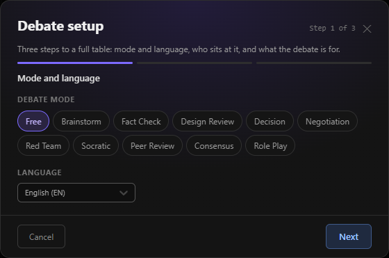
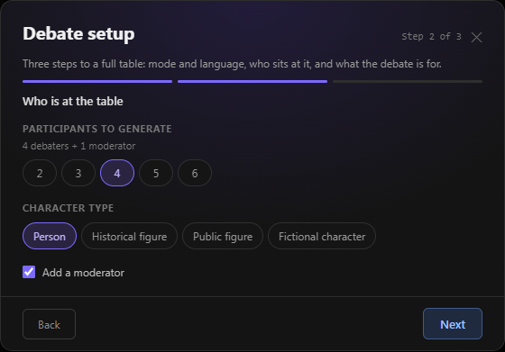
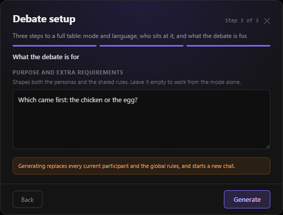

# AI Debate

AI Debate is a local-first environment for running multi-agent conversations with local or remotely hosted LLMs.

The project gives each participant an identity, a model, behavioral traits, constraints, relationships, and access to shared capabilities. Participants can debate, investigate, remember, collaborate, role-play, review proposals, explore alternatives, or work toward a decision. The application provides the context and tools; the models determine how they use them.

It is therefore more than a way to open several chat windows at once: it is a configurable shared space where multiple model-driven agents interact under explicit policies and procedural rules.



## What is AI Debate?

AI Debate started as a structured debate application, but its underlying design is intentionally broader. A session is a shared environment containing a topic, global guidance, participant identities, a conversation history, optional durable memory, and an optional moderator.

Each participant can use a different model and can be configured independently. Their behavior is shaped by personality, mood, communication style, education and age group, constraints, language, and dynamic affinity with the other participants.

The system exposes general-purpose capabilities rather than forcing a fixed chain of steps. Depending on the model, prompts, configuration, and context, participants may decide to look up external information, inspect earlier exchanges, preserve a useful fact in shared memory, or ask the moderator to intervene. These are available capabilities, not guaranteed workflows.

## Why AI Debate?

Many multi-model systems either treat LLMs as independent conversational agents or coordinate them through predefined workflows. AI Debate takes a different approach:

```text
identities + policies + relationships + shared capabilities
                         |
                         v
              a shared model-driven environment
```

The application defines the environment and its boundaries. The participants decide how to reason and interact within it. This makes the same engine useful for structured argument, brainstorming, fact checking, design review, negotiation, decision support, peer review, Socratic inquiry, and fictional role play without implementing each use case as a separate workflow.

The resulting behavior is model-dependent. AI Debate does not claim to guarantee sophisticated emergence; it provides the conditions in which more complex behavior can emerge from the interaction between models, identities, policies, context, and tools.

## Core Features

### Multi-agent conversations

- Run sessions with multiple AI participants.
- Add a manual `User` participant to the conversation.
- Select a model independently for each participant.
- Configure maximum turns, timeouts, turn order, and session language.
- Inject user interjections while a session is running.
- Track participants joining or leaving the conversation.

### Participant identities and behavior

Each participant can have its own:

- name, tag, color, and model;
- character type and general personality instructions;
- response length and delivery style;
- mood and mood intensity;
- age group and education level;
- participant-specific constraints;
- moderator role and moderation behavior;
- dynamic affinity toward other participants.

The participant list provides an overview of the configured table, including each participant's role, model, behavioral traits, and moderator status.



The participant editor exposes the detailed configuration for an individual participant, including model, reasoning and output language, relationships, moderator settings, and participant-specific constraints.



Global constraints and shared personality guidance can be applied to the whole session.

### Guidance modes

Guidance modes are prompt-level behavioral policies that influence the purpose and style of interaction. They are not separate execution pipelines and do not turn the engine into a domain-specific workflow.

- Free
- Brainstorm
- Fact Check
- Design Review
- Decision
- Negotiation
- Red Team
- Socratic
- Peer Review
- Consensus
- Role Play

Modes provide shared guidance for participant turns and conclusions. Participants still generate their own responses and may use the available tools when appropriate.

### Moderator

A moderator is a procedural role, not simply another participant. Depending on its configuration, the moderator can:

- contain hostility or personal attacks;
- enforce the topic;
- fact-check;
- facilitate the discussion and surface agreements, disagreements, and blind spots;
- participate actively with arguments and interpretations;
- act as a role-play master and narrator in Role Play mode.

Moderator authority applies to process and turn management. Substantive claims made by an active moderator remain arguments that can be challenged by other participants.

Participants can also request an explicit moderator intervention outside the normal round structure.

### Agentic tools

Tools are exposed as capabilities that participants may choose to use. They are not mandatory steps in a predefined pipeline.

- `web_search` searches for current external information.
- `fetch_url` reads a web page as Markdown or raw text, preserves links, and supports long-page pagination.
- `get_recent_messages` retrieves selected recent conversation messages, optionally filtered by participant or search term.
- `memory` writes or reads durable shared memory. Entries retain their author, can be filtered by author or query, and are readable by the other participants.
- `request_moderator_intervention` asks the moderator for an extra procedural turn.
- `apply_moderation` lets the moderator apply a procedural intervention.
- `roll_dice` is available to participants in Role Play mode.

These tools represent different kinds of context:

| Capability | Meaning |
| --- | --- |
| Conversation history | What happened in the current discussion |
| Shared memory | What a participant deliberately preserved for future turns |
| Web tools | Information retrieved from outside the session |
| Moderator request | Procedural coordination inside the session |

For example, a participant may retrieve an earlier exchange, verify a claim on the web, and store a useful conclusion in shared memory. That sequence is possible, but it is not prescribed or guaranteed.

## Emergent Behavior

AI Debate is designed for experimentation with model-driven interaction. A participant may combine identity, context, relationships, and tools in ways that are not explicitly encoded as application workflows.

For example, during testing a moderator independently retrieved selected conversation history before issuing a procedural intervention, while participants preserved decisions and simulation state in shared memory without application-level rules specifying what should be remembered.

Other possible patterns include:

```text
shared memory -> reasoning -> web verification -> updated memory
```

or:

```text
conversation history -> identify a procedural problem -> request moderator intervention
```

Whether these patterns occur depends on the selected models, their tool-calling capabilities, the prompts, the session configuration, and the available context.

## Architecture / How It Works



The current provider integration is Ollama-compatible. The provider layer handles endpoint health, model discovery, model capability detection, streaming responses, tool calls, and thinking support. The application keeps orchestration, context, tools, and session state separate from the provider-specific request format.

## Requirements

For a packaged desktop build, the only runtime requirement is access to an Ollama-compatible endpoint.

Node.js and npm are required only when working from the source repository, running the development server, or creating a new build.

The default local endpoint is:

```text
http://localhost:11434
```

## Installation / Getting Started

### Using a packaged build

Install and launch the packaged desktop application for your platform. No Node.js or npm installation is required to run the compiled application.

Start Ollama or configure an Ollama-compatible remote endpoint, then select the endpoint and models in AI Debate.

### Working from source

Install dependencies:

```bash
npm install
```

Start the web development server:

```bash
npm run dev:web
```

Start the desktop development application:

```bash
npm run dev
```

Create a production web build:

```bash
npm run build
```

Create a packaged desktop build:

```bash
npm run build:desktop
```

The desktop application is built with Electron and can target Windows, Linux, and macOS.

## Ollama and Models

AI Debate currently integrates with Ollama-compatible endpoints and supports both local Ollama models and Ollama cloud models exposed by the endpoint.

To make an Ollama cloud model appear in the model selector, run it once from a shell. On Windows, use PowerShell:

```bash
ollama run gemma4:31b-cloud
```

In general:

```bash
ollama run "model-name:cloud"
```

The application discovers models from the configured endpoint and groups local and cloud models in the selector. It also checks the capabilities reported by the endpoint, including whether a model supports tool calls or thinking. Tool-driven behavior therefore depends on the capabilities of the selected model.

## Typical Workflow

1. Start Ollama, or configure an Ollama-compatible remote endpoint.
2. Open the AI Debate desktop application. When working from source, `npm run dev` starts the development server and opens the Electron app.
3. Configure the session guidance, participants, models, constraints, and moderator, either manually or through the conversation wizard.
4. Add a topic and optional attachments.
5. Start the session.
6. Let participants interact, or inject user interjections while the session is running.
7. If appropriate, participants can use tools, retrieve history, write or read shared memory, or request moderation.
8. Generate one or more analytical conclusions after the conversation.
9. Export the session or save a JSON snapshot for later reuse.

## Conversation Wizard

The conversation wizard provides a guided way to create a session without configuring every participant manually from the start. When the application has not been connected yet, it first guides the user through the endpoint connection and default model selection. It then helps set up the participant count, optional moderator, guidance mode, language, and initial participant configuration before the conversation begins.

The wizard is an entry point into the same configurable session engine, not a separate conversation workflow. After the initial setup, the generated configuration can be reviewed and refined through the normal participant, constraint, moderator, and session controls.

After the connection step, the wizard covers three session-setup steps:

1. debate mode and language;
2. participant count, character type, and optional moderator;
3. the purpose of the conversation and any extra requirements.

When needed, the initial connection step covers:

- connecting to the local Ollama endpoint or another compatible endpoint;
- discovering the available models;
- selecting the default model used to generate the initial participants.









## Analysis and Conclusions

After a session, AI Debate can generate different kinds of conclusions:

- Summary
- Considerations
- Contradictions
- Blindspots
- Verdict
- Next steps
- Custom prompt

Conclusion prompts can be adapted to the selected guidance mode and generated with a selected model.

## Constraints and Prompt Policies

Constraints are one of the main ways to shape a session without hardcoding a new workflow. They are written as natural-language rules and included in the system-level prompt context used to guide the models.

Constraints can be defined at two levels:

- **Global constraints** apply to the whole session and establish shared rules for every participant.
- **Participant constraints** apply only to one participant and can express a role-specific responsibility, limitation, perspective, or communication rule.

This makes it possible to combine broad session policies with precise individual behavior. For example, a global constraint can require participants to distinguish evidence from speculation, while a participant-specific constraint can require one agent to challenge assumptions, ask for sources, or summarize unresolved objections before answering.

Constraints can also describe how participants should use the available tools. A rule may instruct an agent to search before making a time-sensitive factual claim, retrieve earlier messages before answering a question about the discussion, preserve an important decision in shared memory, or avoid using a tool unless a specific condition is met. These policies guide tool selection as part of the model's reasoning rather than adding a separate application-level workflow.

This combination of global and participant-level rules allows AI Debate to express complex interaction protocols, research habits, roles, standards of evidence, and tool-use policies while keeping the underlying engine general-purpose. As with other prompt-level guidance, the result depends on the selected model and its ability to follow instructions; constraints should be understood as behavioral policies, not absolute guarantees or security boundaries.

## Reasoning and Output Languages

AI Debate can distinguish between the language used to guide a participant's reasoning and the language used for the visible response. This is useful when a model has been trained more strongly in one language, while the conversation or final answer is intended for another.

The reasoning-language setting guides the model to process the task and structure its response in the selected language before producing the final answer in the conversation's output language. It can therefore be used to combine the model's strongest linguistic patterns with a consistent shared language for the session. This is prompt-level guidance: it does not expose or guarantee a separate internal chain of thought, and the degree of compliance depends on the selected model.

In addition to the predefined language set, participants can use a custom language value. Custom values can represent dialects, regional varieties, constructed languages, or fictional languages such as Elvish or Klingon. These settings are especially useful for role-play, language experimentation, and creating distinct participant voices.

## AI-Assisted Authoring

AI Debate can use an AI suggestion layer while a session is being prepared. Suggestions are generated from the relevant context and can help the user shape the session without taking control of its configuration.

The suggestion tools can help to:

- generate or refine global and participant-specific constraints;
- refine or expand the debate topic;
- propose an individual participant with a suitable identity and behavior;
- improve summary or conclusion prompts based on the current context.

These suggestions are an authoring aid: the user can review, edit, accept, or reject them before they become part of the session. They complement the configurable prompt policies and participant identities rather than replacing them.

## Attachments

The application can attach and parse:

- `.txt`
- `.md`
- `.pdf`

Attached documents can be supplied as session context. The application can also use the configured model to generate a summary of attachments when that option is enabled.

Images are not currently listed as a supported attachment type.

## Exports and Snapshots

Sessions can be exported as:

- HTML for styled reading;
- Markdown for portable text;
- JSON for structured data and restoration.

Local snapshots can preserve the session configuration, participants, topic, conversation messages, conclusions, summary, shared memory, constraints, endpoint, and related settings.

Snapshots can be loaded again to restore a previous session and continue working from its saved topic, configuration, conversation, conclusions, summary, and shared memory. This makes them useful for revisiting an experiment, creating a variation of a session, or repeating a discussion with different models or guidance.

## Examples

The repository includes exported sessions and reusable snapshots under [`examples/`](examples/). They show the kinds of artifacts AI Debate can produce and provide concrete starting points for exploring the application:

- rendered HTML exports for styled reading;
- Markdown exports for portable transcripts;
- JSON snapshots for restoring and continuing a session;
- examples of multi-participant analysis and fictional role-play scenarios.

An exported conversation is a record of a completed session. A snapshot is the reusable session state behind the conversation: it can be loaded back into AI Debate and used as the starting point for a new run.

## Development / Tech Stack

The project is implemented as a React application with a Vite development and build pipeline. It also includes an Electron desktop shell.

Main technologies include:

- React
- Vite
- Electron
- Ollama-compatible HTTP API
- Marked
- PDF.js
- jsPDF
- Vitest

The provider and orchestration layers are kept separate so that the debate engine and its capabilities are not tied to the details of a single HTTP request format.

## Contributing

See [CONTRIBUTING.md](CONTRIBUTING.md) for project contribution guidelines.

## Security and Privacy

AI Debate is designed as a local-first application. Sessions and configuration are stored locally unless the user explicitly exports them. When web tools are used, participants may request external pages through the configured web integration. Model behavior, retrieved information, and generated conclusions should be reviewed by the user.

See [SECURITY.md](SECURITY.md) for the project's security model and limitations.

## License

See [LICENSE](LICENSE) for the applicable license terms.
